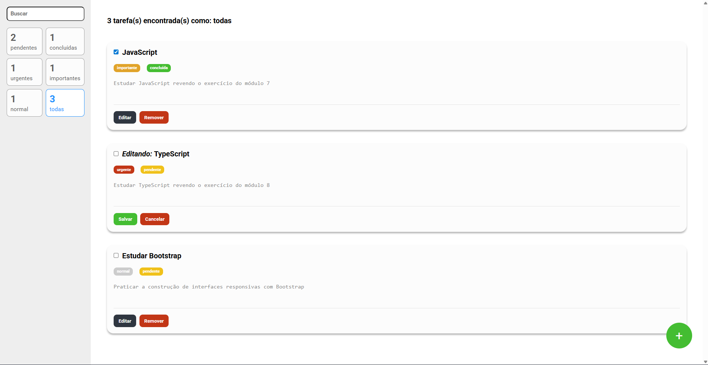

<h1 align="center">
  To Do List em React
</h1>

<div align="center">
  
</div>

# 📝 Minhas Tarefas

Uma aplicação de gerenciamento de tarefas (To-Do List) moderna e robusta, desenvolvida como parte do curso de Engenheiro Front-End da EBAC. O projeto foca em organização, filtragem dinâmica e persistência de estado.

## 🚀 Tecnologias Utilizadas

Este projeto foi construído com o que há de mais moderno no ecossistema React:

- **React** (v18+)
- **TypeScript** - Tipagem estática para maior segurança no desenvolvimento.
- **Redux Toolkit** - Gerenciamento de estado global eficiente.
- **Styled Components** - Estilização baseada em componentes com suporte a Transient Props.
- **React Router DOM** - Navegação entre a lista principal e a tela de cadastro.

## ✨ Funcionalidades

- **CRUD Completo:** Adicione, edite e remova tarefas com facilidade.
- **Filtragem Inteligente:** Filtre suas tarefas por:
  - Termo de busca (nome).
  - Prioridade (Urgente, Importante, Normal).
  - Status (Pendente, Concluída).
- **Contadores Dinâmicos:** Visualize a quantidade de tarefas em cada categoria em tempo real.
- **Interface Responsiva:** Layout adaptável para diferentes tamanhos de tela.
- **Estilização Dinâmica:** Cores das tags mudam automaticamente com base na prioridade ou status selecionado.

## 🛠️ Como Executar o Projeto

1. **Clone o repositório:**
   ```bash
   git clone [https://github.com/Rinkashi17/minhas-tarefas.git](https://github.com/Rinkashi17/minhas-tarefas.git)
Acesse a pasta do projeto:

Bash
cd minhas-tarefas
Instale as dependências:

Bash
npm install
# ou
yarn install
Inicie o servidor de desenvolvimento:

Bash
npm start
# ou
yarn start
A aplicação estará disponível em http://localhost:3000.

📐 Estrutura de Pastas
Plaintext
src/
├── components/     # Componentes reutilizáveis (FiltroCard, Tarefa, etc.)
├── containers/     # Componentes de layout (BarraLateral, ListaDeTarefas)
├── pages/          # Páginas da aplicação (Home, Cadastro)
├── store/          # Configuração do Redux e Slices (reducers)
├── styles/         # Estilos globais e variáveis de cores
├── utils/          # Enums e constantes auxiliares
└── App.tsx         # Componente principal e rotas
📝 Notas de Desenvolvimento
Durante o desenvolvimento, foram aplicadas boas práticas como:

Transient Props ($): Uso do prefixo $ em props do Styled Components para evitar avisos de atributos desconhecidos no DOM.

Seletores Performáticos: Uso de useSelector direcionado para fatias específicas do estado, evitando re-renderizações desnecessárias.

Desenvolvido por Rinkashi17 🚀
